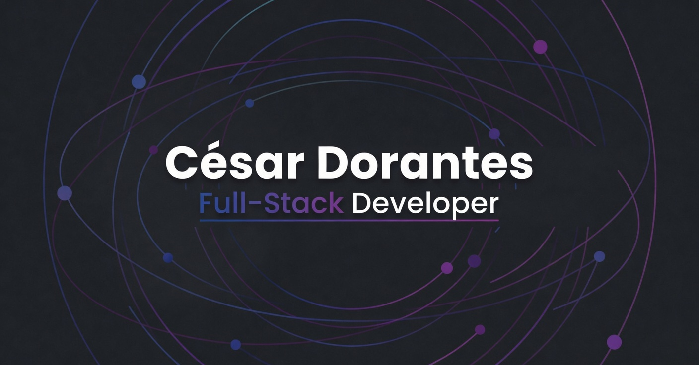

  

# Hey, I'm Cesar 👋

 

### Systems Engineer & Full Stack Developer

---

#### 🇺🇸 English
Building scalable enterprise solutions. I specialize in turning complex business requirements into clean, functional, and creative code.

#### 🇲🇽 Español
Construyendo soluciones empresariales escalables. Me especializo en transformar requerimientos de negocio complejos en código limpio, funcional y creativo.

---

### 🛠️ Technical Stack

- **Backend:**   
- **Frontend:**   
- **Mobile:**  
- **Database & DevOps:**   

---

